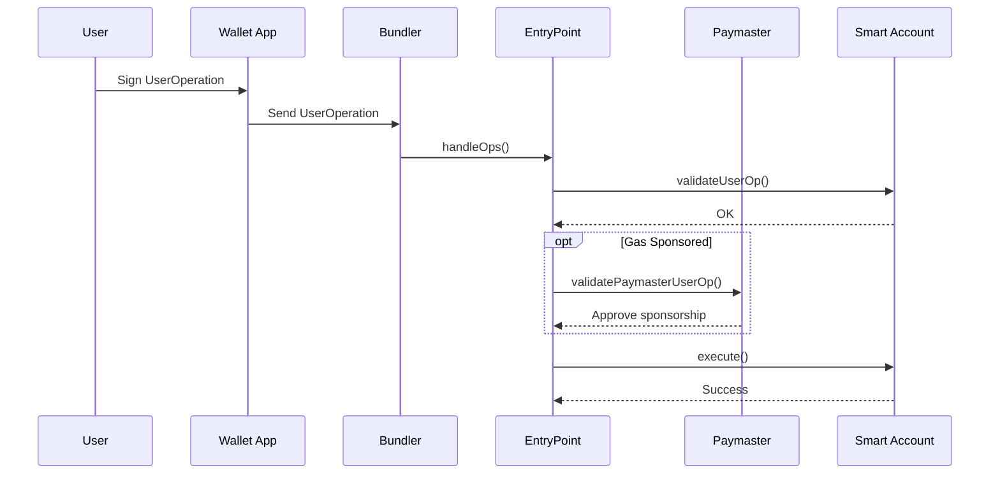
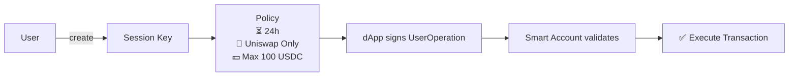

# Account Abstraction với<br>ERC-4337 & EIP-7702

---
transition: fade-out
layout: two-cols-header
---

# Các loại tài khoản trong Ethereum

::left::

<div class="bg-green-100 rounded-xl p-6 border border-green-500 border-opacity-40">

### 🔑 EOA

**Externally Owned Account**

- Tài khoản do người dùng kiểm soát
- Có private key (MetaMask, Ledger,...)
- Xác thực bằng chữ ký ECDSA
- Giao dịch phải trả ETH làm gas

</div>

::right::

<div class="bg-blue-100 rounded-xl p-6 border border-blue-500 border-opacity-40">

### 📜 Smart Contract Account

**Contract-based Account**

- Tài khoản do hợp đồng thông minh kiểm soát
- Không có private key
- Logic xác thực tùy biến (Safe, Gnosis,...)
- Hành vi được lập trình hoàn toàn

</div>

<style>
.two-cols-header {
  column-gap: 50px;
}
</style>

---
transition: fade-out
---

# Vấn đề của EOA

## Hạn chế hiện tại

- Chỉ dùng **private key** để xác thực giao dịch
- Mất key là mất tất cả - **không thể recovery**
- Không hỗ trợ 2FA, multisig tích hợp sẵn
- Không tùy biến được logic xác thực
- **Luôn phải có ETH** để trả gas
- Không thể tự động hóa giao dịch
- Mỗi hành động = 1 giao dịch riêng lẻ

<div class="bg-red-100 border border-red-500 border-opacity-40 rounded-lg p-4 mt-6">
💡 <strong>Kết quả:</strong> UX phức tạp, onboarding khó khăn, bảo mật hạn chế - rào cản lớn nhất cho người dùng mới.
</div>

---
transition: fade-out
---

# Account Abstraction

#### **Account Abstraction** là ý tưởng biến wallet thành một smart contract có logic tùy biến.

<div class="grid grid-cols-3 gap-4 mt-6">
<div class="bg-green-100 bg-opacity-20 border border-green-500 border-opacity-30 rounded-xl p-4">

#### **🔐 Bảo mật nâng cao**

- Passkey / FaceID
- Multisig linh hoạt
- Social recovery
- Spending limits

</div>
<div class="bg-blue-100 bg-opacity-20 border border-blue-500 border-opacity-30 rounded-xl p-4">

#### **⛽ Gas linh hoạt**

- Pay gas bằng ERC-20
- Gasless onboarding
- Paymaster tài trợ gas
- Không cần ETH sẵn

</div>
<div class="bg-purple-100 bg-opacity-20 border border-purple-500 border-opacity-30 rounded-xl p-4">

#### **⚡ UX mượt mà**

- Batch transaction
- Session keys
- Automation
- One-click flows

</div>
</div>

---
transition: fade-out
---

# ERC-4337

#### ERC-4337 cho phép **Account Abstraction (AA)** trên Ethereum mà **không cần thay đổi protocol**.

### **Các thành phần chính**

- 📋 **UserOperation**: đối tượng giao dịch mới
- 🏛️ **EntryPoint Contract**: hợp đồng điều phối trung tâm
- 📦 **Bundlers**: node gom và gửi UserOps
- 💰 **Paymasters**: hợp đồng tài trợ gas (không bắt buộc)

---
transition: fade-out
---

<div class="h-full flex items-center justify-center">



</div>

---
transition: fade-out
---

# UserOperation

#### **UserOperation** là đối tượng thay thế giao dịch thông thường trong ERC-4337.

<div class="grid grid-cols-2 gap-6 mt-4">
<div>

| Field              | Ý nghĩa                         |
| ------------------ | ------------------------------- |
| `sender`           | Smart Account                   |
| `nonce`            | Chống replay                    |
| `callData`         | Hành động cần thực hiện         |
| `signature`        | Chữ ký của user                 |
| `initCode`         | Deploy account nếu chưa tồn tại |
| `paymasterAndData` | Thông tin sponsor gas           |

</div>
<div>

<div class="bg-yellow-100 bg-opacity-20 border border-yellow-500 border-opacity-30 rounded-xl p-4 mb-4">

💡 **Điểm khác biệt**: UserOperation **không phải là giao dịch Ethereum**. Nó được gom lại bởi Bundler và gửi lên chain qua `handleOps()`.

</div>

<div class="bg-sky-100 bg-opacity-20 border border-blue-500 border-opacity-30 rounded-xl p-4">

✅ `initCode` cho phép **tạo ví không cần EOA hay ETH trả trước** - chỉ cần tạo và dùng ngay.

</div>

</div>
</div>

---
transition: fade-out
---

# EntryPoint Contract

#### Là hợp đồng trung tâm của ERC-4337 điều phối toàn bộ quá trình validation và execution.

**handleOps(ops[], beneficiary)**

- Entry point chính của ERC-4337
- Validate từng UserOperation
- Thực thi các UserOperation hợp lệ
- Tính toán và phân phối phí gas
- Thanh toán cho bundler (`beneficiary`)

**simulateValidation(op)**

- Được bundler gọi bằng `eth_call`
- Mô phỏng toàn bộ validation flow
- Revert có chủ ý để trả về kết quả validation
- Giúp bundler quyết định có đưa UserOp vào bundle hay không

---
transition: fade-out
---

**depositTo() / balanceOf()**

- Account và Paymaster nạp ETH vào EntryPoint
- Deposit được dùng để thanh toán gas
- EntryPoint quản lý số dư thay mặt cho các thực thể này

**addStake() / unlockStake() / withdrawStake()**

- Paymaster phải stake trước khi hoạt động
- Stake bị khóa trong một khoảng thời gian (`unstakeDelaySec`)
- Cung cấp economic security cho hệ thống
- Giảm thiểu các hành vi spam và griefing attacks

---
transition: fade-out
---

# Bundlers

##### **Bundler** là actor của ERC-4337 chịu trách nhiệm thu thập UserOperations, xác thực chúng và submit bundle lên EntryPoint.

#### **Bundler làm gì?**

- Nhận UserOperations từ alt-mempool hoặc RPC
- Simulate validation bằng `simulateValidation()`
- Gom các UserOp hợp lệ thành bundle
- Gọi `handleOps()` trên EntryPoint
- Nhận phí gas thông qua `beneficiary`

#### **Tại sao cần Bundler?**

- Ethereum không xử lý UserOperation một cách native
- Bundler là cầu nối giữa UserOperation và Ethereum transaction
- Hoạt động phi tập trung, không cần cấp phép
- Cạnh tranh để kiếm phí thực thi

---
transition: fade-out
---

# Paymasters

#### **Paymaster** là hợp đồng thông minh có thể **tài trợ gas** cho người dùng.

#### Vai trò

- Tài trợ gas cho người dùng
- Cho phép thanh toán bằng token thay vì ETH
- Áp dụng logic kinh doanh khi xác thực giao dịch

#### **Các mô hình phổ biến**

<div class="grid grid-cols-3 gap-4 mt-2">

<div class="bg-green-200 bg-opacity-20 border border-green-500 border-opacity-30 rounded-xl p-4">

#### 🆓 Sponsored

Dự án trả gas cho người dùng

**Ví dụ**

- Gasless onboarding
- Free first transaction
- Marketing campaign

</div>

<div class="bg-blue-200 bg-opacity-20 border border-blue-500 border-opacity-30 rounded-xl p-4">

#### 💱 Token Paymaster

Người dùng trả gas bằng token

**Ví dụ**

- USDC
- Native token
- Không cần giữ ETH

</div>

<div class="bg-purple-200 bg-opacity-20 border border-purple-500 border-opacity-30 rounded-xl p-4">

#### 🔒 Conditional

Chỉ tài trợ khi thỏa điều kiện

**Ví dụ**

- Whitelist
- NFT holder
- Subscription

</div>

</div>

---
transition: fade-out
---

# EIP-7702

#### **EIP-7702** (Pectra hardfork, 2025) cho phép **EOA tạm thời hoạt động như Smart Contract** trong một giao dịch.

### Cơ chế hoạt động

- EOA ký một **authorization** chỉ định contract code
- Trong thời gian giao dịch, EOA **"mượn" bytecode** từ contract đó
- Sau giao dịch, EOA trở về trạng thái bình thường (hoặc giữ code nếu muốn)

---
transition: fade-out
---

### So sánh với ERC-4337

|                   | ERC-4337      | EIP-7702     |
|-------------------|---------------|--------------|
| Account mới       | Smart Account | EOA nâng cấp |
| Thay đổi protocol | Không         | Có (Pectra)  |
| Gas               | Cao hơn       | Thấp hơn     |
| Tương thích       | Mọi chain     | Post-Pectra  |

### Use cases

- **Batch transactions:** gom nhiều hành động trong 1 tx
- **Gas sponsorship:** kết hợp với Paymaster
- **Session keys:** ủy quyền giới hạn cho dApp
- **Multisig nhanh:** không cần migrate wallet

---
transition: fade-out
---

# ERC-4337 + EIP-7702

<div class="grid grid-cols-2 gap-8 mt-6">

<div>

### EOA → Smart Account

Sau Pectra, EOA có thể gửi UserOperation thông qua EIP-7702 delegation.

Flow:

1. Ký authorization
2. Delegate sang smart account logic
3. Gửi UserOp qua EntryPoint
4. Dùng toàn bộ AA features

</div>

<div>

### Lợi ích

- Giữ nguyên địa chỉ ví
- Không cần deploy wallet mới
- Hỗ trợ gas sponsorship
- Hỗ trợ batching
- Hỗ trợ session keys

</div>

</div>

<div class="mt-8 text-center text-sm opacity-70">

EOA + 7702 + ERC-4337 = Smart Account UX mà không cần migrate ví

</div>

---
transition: fade-out
---

# Session Keys

### Ý tưởng

User cấp một key tạm thời cho dApp.

Session key chỉ được phép:

- Trong thời gian nhất định
- Với contract cụ thể
- Trong hạn mức xác định

### Use Cases

- 🎮 Gaming
- 🤖 Trading bots
- 🛒 Recurring payments

---
transition: fade-out
layout: center
---



---
transition: fade-out
---

# Modular Accounts — ERC-6900 & ERC-7579

Smart accounts ngày càng hướng tới kiến trúc **module hóa**, cho phép tùy biến linh hoạt.

<div class="grid grid-cols-2 gap-6 mt-4">
<div>

### Tại sao cần module?

- Logic ví ngày càng phức tạp
- Không muốn audit lại toàn bộ contract khi thêm tính năng
- Upgrade chỉ một phần, không ảnh hưởng phần còn lại
- Chia sẻ module giữa nhiều ví

### Các loại module

| Module | Chức năng |
|--------|-----------|
| **Validator** | Xác thực chữ ký, 2FA |
| **Executor** | Logic thực thi tùy chỉnh |
| **Hook** | Pre/post-execution hooks |
| **Fallback** | Xử lý call không khớp |

</div>
<div class="bg-gray-800 bg-opacity-40 rounded-xl p-4">

```
Modular Smart Account
│
├── [Validator Module]
│     ├── ECDSA Validator
│     ├── Passkey Validator (WebAuthn)
│     └── Multisig Validator
│
├── [Executor Module]
│     ├── Batch Executor
│     └── Auto-pay Executor
│
├── [Hook Module]
│     ├── Spending Limit Hook
│     └── Allowlist Hook
│
└── [Recovery Module]
      ├── Social Recovery
      └── Time-lock Recovery
```

</div>
</div>

---
layout: center
---

# Cảm ơn mọi người!